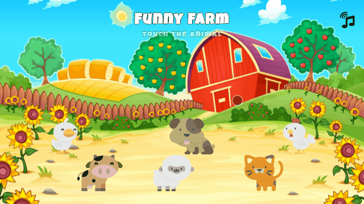

<h1 align="center">Funny Farm</h1>

 

> Funny Farm is a gamelike application uses voices of animals

  
    
  

 

  

 

## Demo

To see the project online click that link <a href="https://mlobunko.github.io/funny-farm/">DEMO</a>

## Installation

Open Git Bash.

Change the current working directory to the location where you want the cloned directory to be made.

Clone repository:

`git clone https://github.com/mlobunko/funny-farm.git`

Install:

`npm install` or `yarn install`

## Development

Runs the app in development mode:

`npm start` or `yarn start`

Runs the test watcher in an interactive mode:

`npm test` or `yarn test`

## Built With

- [React](https://github.com/facebook/react) - A JavaScript library for building user interfaces
- [Redux](https://github.com/reduxjs/redux) - Predictable state container for JavaScript apps
- [Redux-Saga](https://github.com/redux-saga/redux-saga) - An alternative side effect model for Redux apps
- [Howler.js](https://github.com/facebook/jest) - Javascript audio library
- [prop-types](https://github.com/facebook/prop-types) - Runtime type checking for React props
- [Jest](https://github.com/facebook/jest) - JavaScript Testing
- [Enzyme](https://github.com/airbnb/enzyme) - JavaScript Testing utilities for React
- [Redux Saga Test Plan](https://github.com/jfairbank/redux-saga-test-plan) - Test Redux-Saga
- [Reactotron](https://github.com/infinitered/reactotron) - An app for inspecting React, Redux and Redux-Saga
- [Styled Components](https://github.com/styled-components/styled-components) - Visual primitives for the components

- [Prettier](https://github.com/prettier/prettier) - Opinionated code formatter

## License

This project is licensed under the MIT License - see the [LICENSE.md](LICENSE.md) file for details

## Acknowledgments

- [Flaticon](https://www.flaticon.com/) - Images of animals
- [Freepik](https://www.freepik.com/) - Background image
